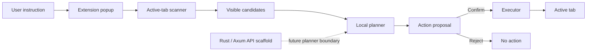

<div align="center">

# ACTIONPILOT 🐈‍⬛

### **See the target. Verify the move. Click with intent.**

A human-in-the-loop browser action agent that inspects the active page, identifies visible interactive elements, proposes a clear action, and executes it **only after explicit user confirmation**.

[](#project-status)
[](#tech-stack)
[](#tech-stack)
[](#safety-model)

**No silent clicks. No blind trust. No “the agent probably meant well.”**

</div>

---

## Why ActionPilot exists

Most browser automation tools optimize for doing more with less supervision.

ActionPilot takes a different position:

> I want to see what the system detected, what it intends to do, and the exact moment control passes from human to machine.

The agent may inspect and propose.  
The user makes the final call.

Like a cat watching a target: **observe first, move once, miss nothing.**

---

## Core workflow

```text
User instruction
       │
       ▼
Scan the active tab
       │
       ▼
Collect visible interactive elements
       │
       ▼
Generate a proposed action
       │
       ▼
Show the target and action to the user
       │
       ▼
Explicit confirmation
       │
       ▼
Execute on the active tab
```



---

## What the current prototype does

- Scans the **currently active tab**
- Finds visible clickable elements
- Accepts a natural-language instruction
- Produces a reviewable action proposal
- Requires explicit confirmation before execution
- Executes only against the active page
- Uses a Chrome Manifest V3 extension architecture
- Includes a Rust + Axum API scaffold for future planner logic
- Documents product safety rules and development workflow

---

## Safety model

ActionPilot is designed as a **visible assistant**, not a hidden bot.

### Required before every action

- The user instruction is visible
- The proposed target is visible
- The proposed action is visible
- Execution requires a deliberate confirmation
- Actions remain limited to the active tab
- Browser permissions should stay minimal

### Intentionally blocked

ActionPilot is not intended to automate:

- CAPTCHA solving or bypass
- Password entry
- 2FA / MFA flows
- Banking operations
- Payments, purchases, or checkout
- Crypto wallet operations
- Account deletion
- Destructive bulk actions
- Hidden background clicking
- Unsupervised mass scraping

> **The claws stay sheathed until the user confirms.**

---

## Architecture

```text
actionpilot/
├── apps/
│   ├── extension/
│   │   ├── public/              # Manifest and extension assets
│   │   ├── src/
│   │   │   ├── background/      # Manifest V3 service worker
│   │   │   ├── content/         # DOM scanning and page interaction
│   │   │   ├── popup/           # User instruction and confirmation UI
│   │   │   └── shared/          # Shared contracts and utilities
│   │   ├── popup.html
│   │   └── vite.config.ts
│   │
│   └── agent-api/
│       ├── src/main.rs           # Axum API entry point
│       └── Cargo.toml
│
├── docs/                         # Safety, product plan and workflow docs
├── scripts/                      # Git helper scripts
└── package.json                  # Workspace commands
```

### Responsibility boundaries

| Component | Responsibility |
|---|---|
| Popup UI | Capture intent, display candidates, show the proposed action, request confirmation |
| Content script | Inspect the page and interact with approved DOM targets |
| Service worker | Coordinate extension messaging and lifecycle |
| Local planner | Convert the instruction and visible candidates into a proposed action |
| Rust API scaffold | Future boundary for planner, policy, and agent services |

---

## Tech stack

| Layer | Technology |
|---|---|
| Browser extension | TypeScript, Vite, Chrome Manifest V3 |
| Browser integration | Content scripts, service worker, active-tab messaging |
| Planner API scaffold | Rust, Axum, Tokio |
| Target browsers | Chrome, Chromium, Edge |
| Repository model | npm workspaces + Cargo project |

Rust is currently used for the backend scaffold and as part of my ongoing practical study of systems and backend development.

---

## Run locally

### Requirements

- Node.js 20+
- npm
- Chrome, Chromium, or Edge
- Rust toolchain only for the API scaffold

### Build the extension

```bash
git clone https://github.com/VitalyRuso/actionpilot.git
cd actionpilot

npm install
npm run build:extension
```

Open your browser extension manager:

```text
chrome://extensions
```

Then:

1. Enable **Developer mode**
2. Select **Load unpacked**
3. Choose `apps/extension/dist`

### Development mode

```bash
npm run dev:extension
```

### Type-check

```bash
npm run typecheck:extension
```

### Run the Rust API scaffold

```bash
npm run dev:agent-api
```

Health check:

```bash
curl http://127.0.0.1:8080/health
```

---

## Manual test

1. Open a normal web page or local HTML fixture
2. Open the ActionPilot extension
3. Select **Scan page**
4. Enter an instruction such as:

```text
Click the login button
```

5. Select **Plan action**
6. Review the proposed target and action
7. Execute only when the proposal is correct

---

## What this project demonstrates

This repository is not only a browser-extension experiment. It demonstrates:

- Separation between perception, planning, confirmation, and execution
- DOM inspection and browser-extension message passing
- Type-safe implementation with TypeScript
- Manifest V3 extension architecture
- Deliberate safety and permission boundaries
- A clean future API boundary using Rust and Axum
- Product thinking around user control, ambiguity, and irreversible actions
- Technical documentation alongside implementation

---

## Project status

**Current stage:** early functional prototype.

The extension workflow and safety model are established. The Rust service currently acts as a backend scaffold rather than a complete remote planner.

### Roadmap

- [x] Manifest V3 extension scaffold
- [x] Active-tab page scanning
- [x] Visible candidate collection
- [x] Reviewable local action proposal
- [x] Explicit confirmation gate
- [x] Rust + Axum health API scaffold
- [ ] Connect the extension to the planner API
- [ ] Add structured local action logs
- [ ] Add automated tests and CI
- [ ] Improve ambiguous-target ranking
- [ ] Add multi-step plans with confirmation checkpoints
- [ ] Add demo GIF and reproducible test fixtures

---

## Design principles

```text
VISIBLE INTENT
      >
PREDICTABLE ACTION
      >
EXPLICIT CONTROL
      >
RAW AUTONOMY
```

ActionPilot does not try to look magical.

It tries to be understandable, inspectable, and difficult to misuse.

---

## Documentation

- [`docs/SAFETY_RULES.md`](docs/SAFETY_RULES.md)
- [`docs/WORK_PLAN.md`](docs/WORK_PLAN.md)
- [`docs/TASK_BOARD.md`](docs/TASK_BOARD.md)
- [`docs/BRANCH_STRATEGY.md`](docs/BRANCH_STRATEGY.md)

---

## Maintainer

Built by [VitalyRuso](https://github.com/VitalyRuso).

I am interested in browser automation, human-in-the-loop AI systems, local-first tooling, full-stack development, and practical agent workflows.

---

<details>
<summary><strong>🐈‍⬛ Developer mood after the DOM changes for the fourth time</strong></summary>

<br>

<div align="center">
  
</div>

<br>

The meme stays down here.  
The confirmation gate stays everywhere.

</details>
